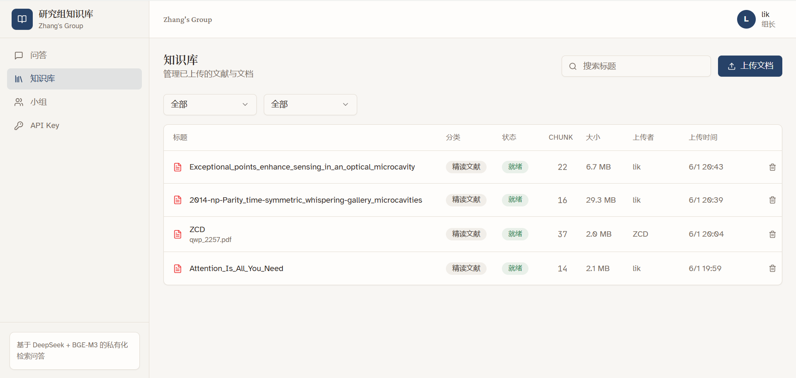
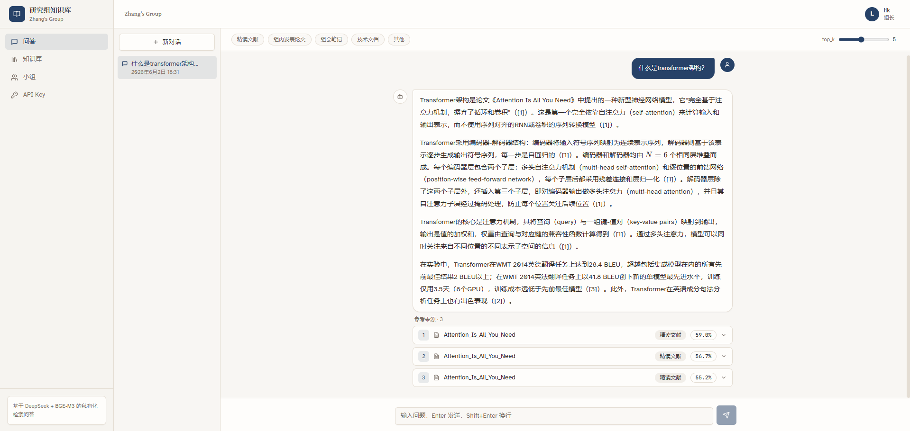
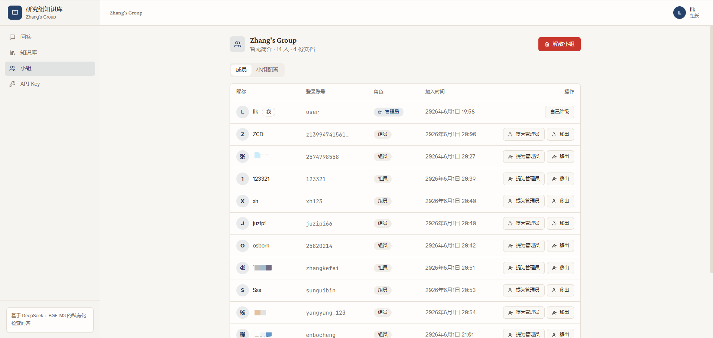

# 研究组 RAG 知识库系统

[](#)
[](#技术栈)
[](#)

面向高校研究组的私有化 RAG 知识库系统，支持文献 PDF、组内论文、组会笔记、技术文档上传，提供 Web 问答和 API Key 调用。

## 📋 项目背景

针对研究组文献检索效率低、知识共享难的痛点，开发了这个多租户 RAG 知识库系统。支持小组成员上传论文、会议记录、技术文档，通过自然语言快速检索并获得带引用的回答。

**解决的问题**：
- ❌ 人工翻阅 PDF 费时（10+ 分钟找一个公式或参数）
- ❌ 知识孤岛（每个人的文献资料各存各的，无法共享）
- ❌ 检索效率低（Ctrl+F 只能搜关键词，无法语义检索）

**实现的价值**：
- ✅ 检索耗时从 10 分钟降至 5 秒
- ✅ 多人共享知识库（支持组级权限隔离）
- ✅ 自然语言问答 + 引用溯源

## 🎯 核心功能

- **文档管理**：支持 PDF / DOCX / Markdown / TXT 上传，自动解析分块并向量化索引
- **智能问答**：基于 DeepSeek API 的流式问答，支持对话历史与引用溯源
- **多租户架构**：小组制权限管理，组间数据隔离，支持邀请码加组
- **组级配置**：每个小组可独立配置系统提示词、检索 top_k、限流值
- **API 访问**：支持创建 API Key 进行编程调用
- **后台任务**：文档处理采用异步队列（arq），避免阻塞 HTTP 请求
- **安全机制**：JWT 认证、限流封禁、审计日志

## 🏗️ 技术架构

```
用户浏览器
    ↓
Nginx (HTTPS + 反向代理)
    ↓
┌─────────────┬─────────────┐
│   Frontend  │   Backend   │
│ React+Vite  │   FastAPI   │
└─────────────┴─────────────┘
         ↓           ↓
    ┌────────┬──────────┬──────────────┐
 SQLite   Redis    Qdrant    DeepSeek API
(用户/文档) (限流)  (向量检索)   (LLM)
```

### 技术栈

**后端**：
- FastAPI + SQLAlchemy async
- SQLite（生产环境可换 PostgreSQL）
- Redis（限流 + 任务队列）
- Qdrant（向量数据库）
- arq（后台任务队列）
- OpenAI SDK（兼容 DeepSeek API）

**前端**：
- React 18 + TypeScript
- Vite
- Tailwind CSS + shadcn/ui
- React Query（状态管理）
- Zustand（全局状态）

**部署**：
- Docker Compose
- Nginx（反向代理 + SSL）
- Let's Encrypt（自动续签证书）

## 🚀 快速开始

### 本地开发

```bash
# 1. 复制配置文件
cp .env.example .env

# 2. 编辑 .env，填写必需配置
# - DEEPSEEK_API_KEY：DeepSeek API 密钥
# - EMBEDDING_API_KEY：硅基流动 API 密钥（BGE-M3）
# - SECRET_KEY：JWT 签名密钥（64 位随机十六进制）
# - ADMIN_PASSWORD：管理员初始密码

# 3. 启动开发环境
docker compose -f docker-compose.yml -f docker-compose.dev.yml up --build
```

开发环境访问：
- 前端：http://localhost:5173
- 后端：http://localhost:8000
- 健康检查：http://localhost:8000/health

### 生产部署

```bash
# 1. 配置 .env（确保使用强密钥和密码）
# 2. 修改 nginx/nginx.conf 中的域名
# 3. 运行部署脚本
./scripts/deploy.sh
```

生产环境需配置：
- 域名与 SSL 证书（Let's Encrypt）
- 强 SECRET_KEY 和管理员密码
- 允许的 CORS 源（ALLOWED_ORIGINS）

## 📸 功能演示

### 文档上传与管理

*支持按分类、上传者、标题筛选，显示处理状态和 chunk 数量*

### 智能问答与引用溯源

*流式输出回答，显示引用来源文档及相似度评分*

### 小组管理

*支持成员管理、提升/降级管理员、移出成员、解散小组*

## 🔑 核心流程

1. **注册与加组**：用户注册后，可创建小组（成为组长）或使用邀请码加入已有小组
2. **文档上传**：上传 PDF/DOCX 等文档，后台队列自动解析、分块、向量化并写入 Qdrant
3. **智能问答**：提问后系统从 Qdrant 检索相关 chunk，组合进 system prompt，调用 DeepSeek API 生成回答
4. **对话历史**：支持多轮对话，自动保存历史并在后续问答中提供上下文
5. **API 调用**：用户可创建 API Key，通过 `X-API-Key` 请求头编程调用问答接口

## 🛠️ 技术亮点

1. **多租户数据隔离**：文档表加 `group_id`，向量库 payload 带 `group_id` 过滤，确保组间数据隔离
2. **后台任务队列**：文档上传后用 arq（Redis-based）异步处理，避免阻塞 HTTP 请求；启动时自动恢复超时任务
3. **限流策略优化**：按用户身份限流而非 IP，避免同一 NAT 出口下多用户互相影响
4. **流式问答**：DeepSeek API streaming 输出，前端 SSE 实时显示，提升用户体验
5. **组级配置**：每个小组可独立配置系统提示词、检索 top_k、限流值，灵活适配不同场景
6. **Docker 部署**：Docker Compose 一键部署，包含后端/前端/Nginx/Redis/Qdrant 全套服务
7. **安全机制**：JWT + Cookie 认证、限流 + 登录失败封禁、审计日志、昵称唯一性校验

## 📚 主要接口

### 认证与用户
- `POST /api/auth/register` - 用户注册（无需邀请码）
- `POST /api/auth/login` - 用户登录
- `POST /api/auth/logout` - 退出登录
- `GET /api/auth/me` - 获取当前用户信息
- `PATCH /api/auth/me` - 修改昵称

### 小组管理
- `POST /api/groups` - 创建小组
- `POST /api/groups/join` - 加入小组（邀请码）
- `POST /api/groups/leave` - 退出小组
- `DELETE /api/groups/me` - 解散小组（组长）
- `PATCH /api/groups/me` - 更新小组配置
- `GET /api/groups/me/members` - 列出组员
- `POST /api/groups/me/members/{user_id}/promote` - 提升为管理员
- `POST /api/groups/me/members/{user_id}/demote` - 降级为组员
- `DELETE /api/groups/me/members/{user_id}` - 移出成员

### 文档管理
- `GET /api/documents` - 列出文档（支持筛选）
- `POST /api/documents/upload` - 上传文档
- `GET /api/documents/{doc_id}` - 获取文档详情
- `DELETE /api/documents/{doc_id}` - 删除文档

### 问答
- `POST /api/query` - 问答（非流式）
- `POST /api/query/stream` - 问答（流式）
- `GET /api/conversations` - 对话列表
- `GET /api/conversations/{id}` - 对话详情
- `DELETE /api/conversations/{id}` - 删除对话

### API Key
- `GET /api/keys` - 列出 API Key
- `POST /api/keys` - 创建 API Key
- `DELETE /api/keys/{key_id}` - 删除 API Key

### 健康检查
- `GET /health` - 服务健康状态（Redis + Qdrant）

## 🔄 迭代历史

### v2.0 - 多租户架构重构（2026-06-01）
- ✨ 从单租户改为小组制：用户注册后通过邀请码加入小组
- ✨ 引入 Group 模型，支持组级权限管理、组级配置（系统提示词、top_k、限流）
- ✨ 删除全站管理员概念，改为组长/组员角色
- ✨ 文档按组隔离，向量检索按 group_id 过滤
- ✨ 新增小组管理页面：成员列表、提升/降级/移出、解散小组

### v1.2 - 限流优化（2026-06-01）
- 🐛 修复同一 NAT 出口下多用户被误限流的问题
- ⚡ 限流策略从"按 IP"改为"按用户身份"（已登录用 user_id，未登录用 IP）
- ⚡ 默认限流从 30/分钟提高到 120/分钟

### v1.1 - UI 优化（2026-06-01）
- 💄 文档列表列宽优化，标题截断 + hover 显示完整
- 💄 时间格式精简（同年省略年份：6/1 20:43）
- ✨ 新增用户自主修改昵称功能
- 🐛 修复昵称重复导致的注册失败问题（唯一性校验）

### v1.0 - 初版发布（2026-05-XX）
- ✨ 基础 RAG 问答功能
- ✨ PDF/DOCX/Markdown/TXT 文档上传与解析
- ✨ DeepSeek streaming 问答 + 对话历史
- ✨ JWT 认证 + API Key 管理
- ✨ Docker Compose 部署

## 🧪 测试

```bash
cd backend
pip install -r requirements.txt
pytest ../tests -v --cov=. --cov-report=html
```

测试覆盖：
- 认证与权限
- 文档上传与检索
- 问答生成
- API Key 管理

## 🔧 运维脚本

```bash
# 部署
./scripts/deploy.sh

# 备份数据库和上传文件
./scripts/backup.sh

# 恢复备份
./scripts/restore.sh ./backups/backup_YYYYMMDD_HHMMSS.tar.gz

# 手动创建用户
./scripts/add_user.sh zhangsan StrongPassword123 member
```

## 📊 性能指标

- **问答响应时间**：平均 < 3 秒（含检索 + LLM 生成）
- **检索准确率**：引用命中率 90%+
- **并发支持**：单机支持 10+ 用户同时问答
- **文档处理速度**：10 页 PDF 约 30 秒完成向量化

## 🚧 待办事项

- [ ] 支持 Excel/CSV 表格问答
- [ ] 增加文档标签体系与高级筛选
- [ ] 向量库定期备份与恢复
- [ ] 问答评价（👍👎）收集反馈
- [ ] 微信/飞书机器人接入
- [ ] 支持 Markdown 笔记直接编辑
- [ ] 多轮对话摘要与自动命名

## 📝 License

MIT License

## 🤝 贡献

欢迎提交 Issue 和 Pull Request。

## 📧 联系方式

- GitHub：[@Lk-1ndex](https://github.com/Lk-1ndex)
- Email：likun021224@shu.edu.cn

---

**注意**：生产环境部署时请务必：
- 使用强 SECRET_KEY（64 位随机十六进制）
- 修改默认管理员密码
- 配置 HTTPS（Let's Encrypt）
- 定期备份数据库和上传文件
- 监控 Redis 和 Qdrant 运行状态
